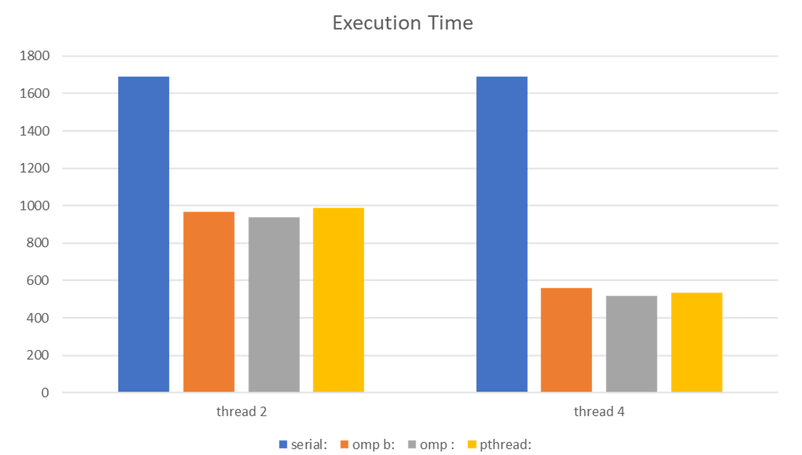
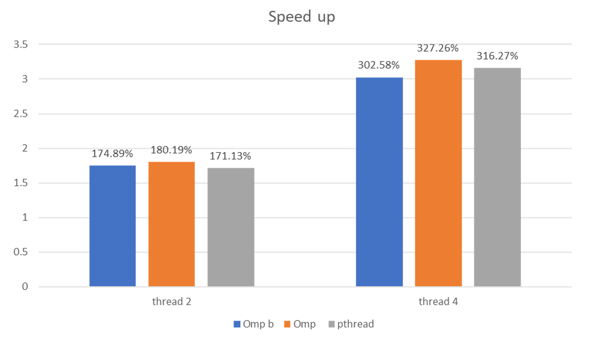
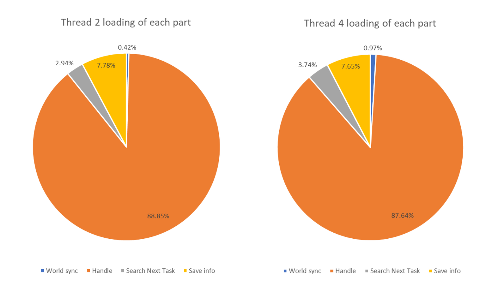
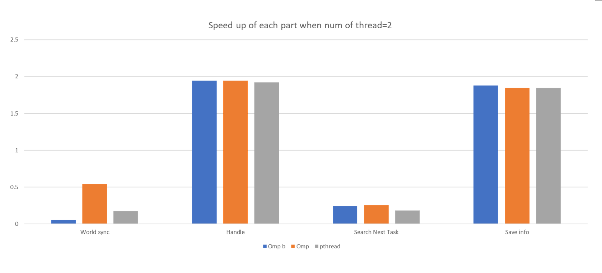

# Parallel Execution of Multi-Player Cooperative Tasks Simulation

I-Ting Ho, Shao-Chun Huang, Wei-Chun Lin  
Graduate Institute of Computer Science and Engineering 310551143, Institute of Network Engineering 310552041, Department of Computer Science and Engineering 0716332
k232421@gmail.com, shanan2224466@gmail.com, wjlim.cs07@nycu.edu.tw  

## Abstract

In this study, we aim to improve user demands in simulation environments through multi-threading. Simulation environments are computationally intensive tasks, and handling such workloads with a single-thread can lead to severe system delays. Therefore, multi-threading can speed up the entire process, enhancing the performance of the simulation environment. The results also show that using multi-threading can significantly reduce execution time.

## Introduction

Our simulation system primarily calculates the time and resources required for workers to complete tasks. First, these workers need to select tasks from the remaining workload, and the remaining workload needs to be reduced by the amount taken by the workers. Therefore, tracking the number of tasks is essential in the entire simulation system.

Another crucial function is time synchronization, which calculates and estimates the workload workers can handle within a fixed time frame, such as per hour or per day. Regardless, there needs to be a time interval to synchronize every hour or every 24 hours to avoid discrepancies in workload distribution. Given this, we need a protected timer for synchronization.

Our process is straightforward: within each fixed time, calculate and estimate the tasks each worker handles. If tasks are completed, workers take on remaining tasks. Their efficiency depends on their settings, and the calculations are handled by single-thread, multi-thread, or multi-host implementations.

## Proposed Solution

By sharing certain data, the original single-threaded simulation system can be rewritten into a multi-threaded program using shared memory. This is because we believe shared memory is more suitable for parallelizing the simulation system, as GPU operations cannot meet our critical section requirements, and the calculations are not extensive enough to benefit from GPU acceleration. Similarly, MPI is unsuitable due to frequent shared data access, requiring network communication, which can degrade performance compared to single-threaded execution.

Work distribution among threads is done by evenly allocating workers, who calculate and estimate their task completion within the time segment. This method is intuitive and reasonable.

To avoid race conditions, shared data like remaining tasks and timers must be protected. In pthreads, we use atomic operations and mutex locks, while in OMP, we use atomic operations and critical sections. MPI inherently avoids shared memory issues, requiring network requests to access data from the master host.

## Experimental Methodology

We set up 50 tasks, each with 100,000 units, and a maximum of 5 workers per task. There are 60 workers, each capable of handling 1,000 units per task, with varying preferences but consistent efficiency. The tests were conducted on the provided server with an Intel i5-7500 processor, Ubuntu 20.04, and 6GB of RAM. Each method was run 20 times, and average times were measured for various components.

## Experimental Results

With only 4 cores on the server, we used up to 4 threads. Comparing OMP barriers, we implemented a custom barrier using busy waiting, which showed performance improvements over `#pragma omp barrier`.

| Unit: ms | omp barrier | Our barrier |
|----------|-------------|-------------|
| Thread 2 | 967.55      | 939.09      |
| Thread 4 | 559.22      | 517.05      |

OMP showed the best performance, with pthreads performing comparably well, achieving near-thread count speedup. The custom barrier in OMP provided better results than the default.

| Unit: ms | Serial  | OMP Our Barrier | Pthread  |
|----------|---------|------------------|----------|
| Thread 2 | 1692.55 | 939.09           | 988.76   |
| Thread 4 | 1692.55 | 517.05           | 535.02   |

The graphs below depict execution time and speedup for various methods.

MPI did not complete due to the high communication overhead in the later stages of the simulation, where fewer tasks remain, causing workers to continually request tasks from the master host.

## Experimental Breakdown

The time spent on different parts of the simulation was recorded, showing most time spent on processing tasks, followed by storing information, with synchronization taking the least time. This indicates the need to optimize task processing.

| Unit: ms | Serial | Thread 2 | Thread 4 |
|----------|--------|----------|----------|
| Sync     | 1.73   | 3.19     | 3.81     |
| Process  | 1301.26| 669.41   | 342.25   |
| Select   | 5.655  | 22.16    | 14.61    |
| Store    | 108.43 | 58.64    | 29.87    |

OMP was more efficient than pthreads, especially in synchronization, where OMP optimizes barrier release among threads.

| Unit: ms | OMP  | Pthread |
|----------|------|---------|
| Sync     | 3.19 | 9.66    |
| Process  | 669.41| 677.09 |
| Select   | 22.16| 31.40   |
| Store    | 58.64| 58.77   |

## Related Work

Simulations are valuable when major system changes are needed or for long-term data analysis [2]. Cooperative task simulation designs were referenced from [3], incorporating the idea of distributed task handling without requiring synchronization, thus reducing critical section access. The concept of each thread having a local time variable was taken from [4], allowing for parallel simulation with discrete event communication.

## Conclusions

Our simulation system applies to both dynamic and static scenarios, focusing on improving performance through multi-threading. As shown, OMP with our custom barrier offers the best performance, but pthreads also achieve significant speedup using idle processor cores.

## References

1. Ricki G. Ingalls, "The value of simulation in modeling supply chains," IEEE Proceedings of the 30th conference on Winter simulation, Washington DC USA, Dec. 1998.
2. J.S. Carson, "Introduction to modeling and simulation," IEEE Proceedings of the 2004 Winter Simulation Conference, Washington DC USA, Dec. 2004.
3. M. M. Fioroni, L. Franzese, T. J. Bianchi, L. Ezawa, L. R. Pinto, and G. d. Miranda Junior, "Concurrent simulation and optimization models for mining planning," IEEE 2008 Winter Simulation Conference, Miami FL USA, Dec. 2008.
4. Richard Fujimoto, "Parallel and distributed simulation," Proceedings of the 2015 Winter Simulation Conference, Atlanta USA, Dec. 2015.
5. A. M. Law and M. G. McComas, "Simulation of manufacturing systems," Proceedings of the 29th conference on Winter simulation, Dec 1997.
6. G. Lugaresi and A. Matta, "Real-time simulation in manufacturing systems," Winter Simulation Conference 2018, Gothenburg Sweden, Dec 2018.
